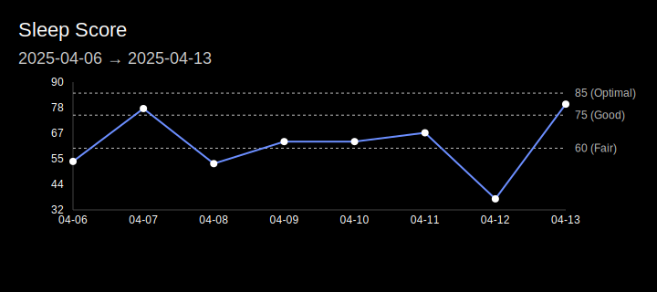

<div align="center">
  <h1>
    
    Oura Profile Cards
  </h1>
  
  
  
  
  <p>
    <strong>Oura Profile Cards</strong> is a GitHub Action that generates SVG cards (e.g., a weekly readiness chart) using data collected by the <a href="https://ouraring.com/">Oura Ring</a>. These cards allow you to showcase your health metrics and insights on your GitHub profile.
  </p>
</div>

> [!Note]
> You must have an Oura Ring and a valid API token to use this action. Learn more about the Oura API [here](https://cloud.ouraring.com/docs).

## Available Cards

### Weekly Cards

These cards display your Oura Ring metrics over the past 7 days with threshold indicators for optimal, good, and fair levels:

#### Readiness


#### Sleep



## Usage

### Setup

1. **Create a workflow file** in your repository (e.g., `.github/workflows/oura-profile-cards.yml`) with the following content:

```yaml
name: Oura Profile Cards

on:
  schedule:
    - cron: '0 */3 * * *' # Run every 3 hours (adjust as needed)
  workflow_dispatch: # Allow manual triggering

jobs:
  build:
    runs-on: ubuntu-latest
    steps:
      - uses: actions/checkout@v4
      - uses: savvan0h/oura-profile-cards@v0.1.0
        with:
          OURA_API_TOKEN: ${{ secrets.OURA_API_TOKEN }}
```

2. **Add your Oura API token** as a repository secret:
   - Go to your repository's [Settings] > [Secrets and variables] > [Actions]
   - Create a new secret named `OURA_API_TOKEN` with your [personal access token](https://cloud.ouraring.com/personal-access-tokens)

### Using Generated Cards

The action automatically:

1. Fetches your latest Oura Ring data
2. Generates SVG charts in the `oura-profile-card-output` directory
3. Commits and pushes these files to your repository

To display cards in your GitHub profile README, use the following Markdown syntax:

```markdown


```

For a live example, see [@savvan0h's profile](https://github.com/savvan0h).

## Development

### Prerequisites

- Node.js (version 20 or higher)

### Running Locally

1. **Clone the repository:**

   ```bash
   git clone https://github.com/savvan0h/oura-profile-cards.git
   cd oura-profile-cards
   ```

2. **Install dependencies:**

   ```bash
   npm install
   ```

3. **Set your Oura API token:**

   ```bash
   export INPUT_OURA_API_TOKEN=your_oura_api_token_here
   ```

4. **Run the action locally:**

   ```bash
   npm run start
   ```

   Note that running locally will not commit changes to your repository.

## Troubleshooting

If your cards aren't generating:

- Check that your workflow is running properly in the Actions tab
- Verify your Oura API token is correct
- Make sure your Oura Ring is synced and providing data

## License

This project is MIT licensed. Feel free to use, modify, and distribute it.
